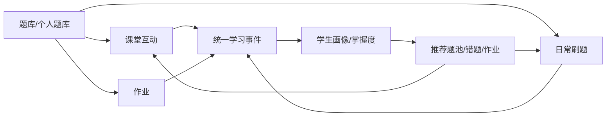

# Fushua 成熟产品设计蓝图与智能体交接文档

> 面向接手开发的智能体/工程师。本文是当前阶段的主产品文档，优先级高于已归档的 localStorage 过渡期文档。

## 0. 一句话定位

Fushua 要做成一个面向中学教学场景的综合工具平台：教师在 Web 端完成课堂互动、题库管理、作业布置和学情分析；学生在微信小程序端完成刷题、作业、错题复习和个人学习反馈；管理员在 Web 后台维护账号、班级、内容、安全和运营。

成熟产品的关键不是“功能多”，而是形成一个闭环：



## 1. 当前项目事实

项目根目录：

```text
C:\Users\Windows 10\Desktop\trae\fushua
```

当前线上域名：

```text
https://www.fushua.asia
```

当前主要技术栈：

- 后端：FastAPI、SQLAlchemy。
- 生产数据库：PostgreSQL。
- Web 端：Jinja 模板、部分页面内嵌 JS/React。
- 小程序端：微信小程序原生 WXML/WXSS/JS。
- 当前课堂入口：`/teacher/classroom`。
- 当前课堂 API：`/api/v1/classroom/*`。

当前三大模块雏形：

- 课堂管理：已接入课堂伴侣页面，已有课堂 session/draw/snapshot 基础表和 API。
- 刷题与作业：小程序已有刷题、作业、错题、我的；Web 端已有教师作业和学生练习相关页面。
- 个人题库管理：Web 端已有教师题库、题目导入、字段配置、题目管理。

当前最大风险：

- `app/templates/teacher/classroom.html` 仍是约 150KB 的大模板，包含大量前端状态逻辑。
- `app/static/classroom-api.js` 与课堂模板仍保留 localStorage 双模式思想。
- 课堂数据还没有完全云端唯一化。
- 旧报告曾声称“可交付/96%/localStorage 可用”，这些表述已不适合作为成熟产品开发依据。

已处理：

- 旧的 localStorage 过渡期文档已归档到：

```text
docs/_archive/2026-06-10-localstorage-transition-docs/
```

## 2. 类似产品参考与可借鉴点

本文参考公开资料，不要求照搬任何产品，只吸收成熟产品的结构思路。

| 产品 | 公开定位/能力 | 对 Fushua 的启发 |
| --- | --- | --- |
| Google Classroom | 课堂、作业、分发、批改、成绩管理中心。Google 官方介绍其能创建课程、分发 coursework、批改并透明管理。 | Fushua 需要一个“教学事务中枢”，让作业、班级、学生和成绩进入统一工作流。 |
| Kahoot! | 课堂游戏、实时参与、即时反馈、课后报告。官方强调 live game、student-paced challenge、game reports。 | 课堂伴侣要有强互动和即时反馈，不能只是表格管理。 |
| Wayground / Quizizz | 将 instruction、practice、assessment 和教师洞察结合，强调 AI 适配资源和跟踪学生。 | Fushua 的题库、刷题、作业、课堂要共享题目和学情，而不是三个孤岛。 |
| Nearpod | 教师推送互动课程，学生 live 或 self-paced 参与，教师获得实时反馈和课后报告。 | Fushua 课堂模式要支持“上课中实时看懂”和“课后沉淀”。 |
| ClassDojo | 行为积分、课堂社区、学生作品集、家校沟通。 | 可借鉴“课堂积分/行为反馈/学生成长证据”，但暂不做家校沟通主线。 |
| Quizlet | 闪卡、练习测试、学习活动、AI 学习工具。 | 学生端错题和题库可演化成轻量个人学习系统。 |
| Seesaw | 捕捉学习过程，形成学生数字作品集，让成长可见。 | Fushua 可把课堂答题、作业、错题、总结变成“学习证据流”。 |
| Desmos / Amplify Teacher Dashboard | 教师可在活动进行中实时查看学生进度和作品。 | 课堂伴侣中间屏应像“教师驾驶舱”，上课时不用跳很多页面。 |

参考链接：

- Google Classroom: https://edu.google.com/intl/ALL_us/workspace-for-education/products/classroom/
- Google Classroom grading concepts: https://developers.google.com/workspace/classroom/guides/key-concepts/grades
- Kahoot! schools: https://kahoot.com/schools/how-it-works/
- Wayground: https://wayground.com/
- Nearpod formative assessment: https://nearpod.com/formative-assessment
- ClassDojo: https://www.classdojo.com/
- Quizlet: https://quizlet.com/
- Seesaw: https://seesaw.com/
- Desmos/Amplify teacher dashboard: https://service.amplify.com/article/9269355-amplify-desmos-math-using-the-teacher-dashboard

## 3. 成熟产品原则

### 3.1 云端唯一事实来源

课堂伴侣业务数据必须直接写入云端数据库。不能再设计“本地模式/API 模式”。

禁止把以下业务数据放在 localStorage：

- 班级、学生、题目、题库。
- 课堂 session。
- 抽取历史。
- 答题结果。
- 课堂积分。
- 分组结果。
- 学生掌握度。
- 题目快照。

localStorage 只允许保存非业务偏好：

- 主题。
- 是否折叠侧栏。
- 最近打开的 tab。
- 新手引导是否已读。

### 3.2 所有行为都沉淀为学习事件

成熟产品不能只保存页面结果，要保存过程事件。建议引入统一学习事件层：

```text
learning_events
- id
- user_id
- class_id
- source_type: practice | homework | classroom | manual
- source_id
- question_id
- event_type: answer_correct | answer_wrong | skip | assign | submit | score_adjust | mastery_update
- result
- score_delta
- duration_seconds
- meta_json
- created_at
```

这样课堂、刷题、作业都能进入同一条数据流。短期可以先用现有 `records`、`assignment_records`、`classroom_draw_records` 聚合；中期应新增统一事件表。

### 3.3 教师上课要快，学生学习要轻，管理员后台要稳

- 教师 Web：信息密度高，操作路径短，大按钮、低干扰、清晰状态。
- 学生小程序：轻量、鼓励、每日可完成，优先“下一题/继续学/看错题”。
- 管理员后台：安全、审计、备份、账号和数据修复优先，视觉克制。

### 3.4 不做伪成功

如果 API 保存失败，必须告诉用户。不要悄悄存本地，不要假装已同步。

### 3.5 UI 风格服务教学现场

“文墨学苑/新中式教育”是品牌氛围，不是装饰堆叠。课堂页面尤其要克制：上课时教师只关心“谁、哪题、答得怎样、下一步做什么”。

## 4. 角色与核心场景

### 4.1 教师

教师的核心工作流：

1. 课前：维护题库、导入题目、选择班级、准备课堂题池。
2. 课中：抽学生、抽题、记录回答、分组、加减分、查看参与度。
3. 课后：查看课堂总结、生成巩固作业、查看薄弱点。
4. 长期：查看学生画像、班级趋势、题库使用效果。

### 4.2 学生

学生的核心工作流：

1. 登录/绑定。
2. 今日刷题。
3. 完成作业。
4. 查看错题。
5. 查看个人成长和掌握度。

### 4.3 管理员

管理员的核心工作流：

1. 管理用户、角色、班级。
2. 维护公共题库和字段。
3. 查看系统健康、备份、安全日志。
4. 处理账号找回、异常数据、权限问题。

## 5. 产品模块设计

### 5.1 课堂伴侣

定位：教师上课时使用的互动驾驶舱。

核心功能：

- 创建/恢复课堂。
- 选择班级。
- 选择题池。
- 随机抽学生。
- 随机抽题/按薄弱点抽题/按题库筛选抽题。
- 记录回答：正确、错误、跳过、补充说明。
- 手动加减分。
- 随机分组。
- 实时积分榜。
- 参与度统计。
- 课堂总结。
- 从课堂错题生成作业。

成熟状态下的页面布局：

```text
┌────────────────────────────────────────────────────────────┐
│ 顶栏：课堂状态 / 当前班级 / 云端保存状态 / 结束课堂          │
├───────────────┬──────────────────────────────┬─────────────┤
│ 左栏          │ 中央主舞台                    │ 右栏        │
│ 班级          │ 当前被抽学生                  │ 积分榜      │
│ 题池          │ 当前题目                      │ 参与度      │
│ 会话历史      │ 正确/错误/跳过/加分            │ 最近记录    │
│ 分组入口      │ 下一位/下一题                  │ 风险学生    │
├───────────────┴──────────────────────────────┴─────────────┤
│ 底部快捷条：开始课堂 / 抽人 / 抽题 / 记录 / 分组 / 总结      │
└────────────────────────────────────────────────────────────┘
```

设计要求：

- 课堂中所有主要操作一屏完成。
- 关键按钮要大，文字短。
- 不能让教师在上课时频繁跳转。
- 云端保存状态必须可见，例如“已保存 23:10:05 / 保存中 / 保存失败”。

### 5.2 题库与个人题库

定位：所有教学活动的内容源。

核心功能：

- 题目录入、导入、编辑、删除。
- 公共题库、教师私有题库、班级共享题库。
- 学科、年级、章节、难度、题型、标签。
- 题目版本和课堂快照。
- 题目使用统计。
- 题目质量反馈。
- 从错题和课堂记录反向推荐题目。

推荐页面：

- `题库总览`：题量、学科分布、最近导入、质量问题。
- `题目列表`：筛选、批量编辑、导入导出。
- `题目详情`：题干、答案、解析、使用记录、错误率。
- `题池构建器`：为课堂/作业选择题目。

### 5.3 刷题与作业

定位：学生日常学习和教师课后巩固。

核心功能：

- 学生日常刷题。
- 作业列表、作业详情、提交。
- 错题本。
- 掌握度。
- 每日目标。
- 教师布置作业。
- 教师查看完成情况和薄弱点。
- 从课堂总结一键生成巩固作业。

小程序 tab 建议：

```text
今日学习 / 作业 / 错题 / 我的
```

当前已有 tab 是“刷题 / 作业 / 错题本 / 我的”，可保留，但下一轮 UI 优化建议把“刷题”升级成“今日学习”，里面包含继续刷题、待完成作业、复习错题、课堂反馈。

### 5.4 学情分析

定位：把数据变成教师下一步动作。

核心指标：

- 班级正确率。
- 学生参与率。
- 学生正确率。
- 章节掌握度。
- 题目错误率。
- 作业完成率。
- 课堂活跃度。
- 连续未参与/连续答错/长期未练习。

输出形式：

- 教师首页卡片。
- 班级详情趋势图。
- 学生详情画像。
- 课堂总结。
- 作业报告。
- 错题推荐题池。

### 5.5 管理后台

定位：生产系统运维与数据治理。

核心功能：

- 用户管理。
- 班级管理。
- 邀请码。
- 账号找回。
- 数据备份。
- 审计日志。
- 公告。
- 公共题库管理。
- 异常数据修复。
- 系统健康检查。

管理员后台不追求强风格化，应以可靠、可扫描、可恢复为主。

## 6. 页面信息架构

### 6.1 教师 Web

建议主导航：

```text
首页
课堂
题库
作业
班级
学生
学情
导入
设置
```

教师首页布局：

```text
顶部：今日提醒、快速开始课堂、创建作业
第一行：班级概览 / 待批改 / 今日课堂 / 作业完成率
第二行：风险学生 / 高频错题 / 最近课堂记录
第三行：快捷入口：导入题目、创建题池、发布作业、查看报告
```

课堂页布局见 5.1。

题库页布局：

```text
左：题库/标签/章节筛选
中：题目列表
右：题目预览与操作
```

作业页布局：

```text
顶部：创建作业 / 从课堂生成 / 从错题生成
列表：进行中 / 待批改 / 已结束
详情：完成矩阵 / 学生列表 / 题目分析 / 提醒
```

学生详情页布局：

```text
顶部：学生信息、班级、近期状态
卡片：正确率、完成率、课堂参与、错题数
图表：章节掌握度、最近练习趋势
列表：错题、作业、课堂记录
操作：生成练习、加入关注、导出报告
```

### 6.2 学生小程序

启动路径：

```text
打开小程序
→ 自动登录/微信授权
→ 绑定手机号或开发期开关跳过验证码
→ 今日学习首页
```

今日学习页：

```text
顶部：问候 + 今日目标
主卡：继续刷题 / 待完成作业
次卡：错题复习 / 课堂反馈 / 掌握度
底部：最近成就/学习 streak
```

作业页：

```text
Tabs：待完成 / 已完成
卡片：作业名、截止时间、题量、状态
详情：题目逐题答、提交、结果、解析
```

错题页：

```text
筛选：学科、章节、来源（刷题/作业/课堂）
列表：错题卡
操作：再练一次、标记掌握、收藏
```

我的页：

```text
头像昵称
班级信息
学习数据
收藏/反馈/设置/退出
```

### 6.3 管理 Web

建议主导航：

```text
总览
用户
班级
题库
公告
审计
备份
系统
```

管理员总览：

```text
系统健康
用户数量
班级数量
题目数量
今日活跃
最近错误
备份状态
风险操作
```

## 7. UI 视觉系统

### 7.1 品牌方向

当前视觉方向：新中式、书院感、温润纸色、墨绿主色、少量朱砂/金色点缀。

关键词：

```text
文墨、书院、温润、清晰、可信、克制、现代教育工具
```

不要走：

- 过度仿古。
- 满屏纹理。
- 过多毛笔字。
- 低对比浅色导致课堂投屏看不清。
- 管理后台过度装饰。

### 7.2 色彩建议

```text
主色：#176B57 墨绿
深主色：#0F3D33
浅主色：#E7F3ED
纸色背景：#F7F0DF
内容底色：#FFFCF4
朱砂强调：#B8452E
金色点缀：#C7A45B
成功：#2E7D32
警告：#B26A00
错误：#B3261E
文字主色：#1F2A24
文字次色：#6B756E
边框：#E3D8C3
```

### 7.3 字体和排版

Web：

- 正文优先系统字体。
- 标题可以使用更有书卷感的字体，但不要影响加载和清晰度。
- 数据页面字号不要过大。

小程序：

- 保持系统字体。
- 标题短、卡片清楚。
- 一屏只强调一个主行动。

### 7.4 组件规范

通用组件：

- 主按钮：墨绿底白字。
- 次按钮：浅绿底墨绿字。
- 危险按钮：朱砂色。
- 卡片：圆角 8px，不做大圆角气泡。
- 表格：紧凑，支持筛选和空状态。
- 标签：用于学科、章节、难度、来源。
- 状态条：保存中、已保存、失败、离线。
- 空状态：说明下一步动作，不只说“暂无数据”。

课堂专用组件：

- 当前学生卡。
- 当前题目卡。
- 课堂操作按钮组。
- 积分榜。
- 参与度条。
- 最近记录流。
- 保存状态指示器。

## 8. 数据互通设计

### 8.1 核心实体

```text
User
ClassGroup
ClassMember
QuestionBank
Question
Assignment
AssignmentRecord
Record / PracticeRecord
ClassroomSession
ClassroomDrawRecord
ClassroomQuestionSnapshot
LearningEvent
MasteryRecord
Notification
AuditLog
```

### 8.2 来源统一

| 行为 | 当前可能落点 | 成熟产品落点 |
| --- | --- | --- |
| 学生刷题 | `records` | `records` + `learning_events` |
| 学生作业提交 | `assignment_records` | `assignment_records` + `learning_events` |
| 课堂答题 | `classroom_draw_records` | `classroom_draw_records` + `learning_events` |
| 教师手动调分 | 课堂记录或未来积分事件 | `classroom_score_events` + `learning_events` |
| 题目被使用 | 分散统计 | `question_usage_events` 或 `learning_events.meta_json` |
| 错题复习 | `records` | `records` + mastery 更新 |

### 8.3 统计统一

学生画像应从多个来源汇总：

```text
practice records
+ assignment records
+ classroom draw records
→ learning events
→ mastery records
→ student profile
```

题目画像应从多个来源汇总：

```text
question used in practice/homework/classroom
→ attempt count
→ wrong count
→ class-level weak points
→ recommend to classroom/homework/practice
```

### 8.4 课堂到作业

课堂结束后，教师可以：

1. 查看课堂总结。
2. 勾选本节课答错最多的题。
3. 自动补充同章节同难度题。
4. 生成巩固作业。
5. 推送给全班或部分学生。

### 8.5 错题到课堂

教师创建课堂题池时，可以选择：

- 本班高频错题。
- 某章节薄弱题。
- 上次作业错题。
- 某学生个人薄弱点。
- 教师自选题库。

## 9. 成熟度分级

### 9.1 Internal Alpha

目标：开发自测。

必须满足：

- 本地测试可运行。
- 核心页面能打开。
- 课堂不再新增 localStorage 业务数据。

### 9.2 Teacher Pilot

目标：小范围教师真实试用。

必须满足：

- 教师能创建课堂、抽人、抽题、记录结果。
- 刷新页面可恢复课堂。
- 课堂记录云端保存。
- 学生小程序刷题、作业、错题稳定。
- 基础备份和健康检查可用。

### 9.3 Mature Beta

目标：可给真实班级持续使用。

必须满足：

- 课堂、刷题、作业、题库形成数据闭环。
- 学生画像能解释数据来源。
- 错题能跨来源聚合。
- 教师能从课堂生成作业。
- 关键页面有空状态、错误状态、加载状态。
- 有操作日志和备份恢复方案。

### 9.4 Production Ready

目标：可长期对外运营。

必须满足：

- 真机小程序体验版验证通过。
- HTTPS、域名、小程序合法域名配置稳定。
- 数据库迁移可回滚。
- 备份恢复演练通过。
- 安全组、SSH、环境变量、密钥管理收敛。
- 管理员能处理账号、班级、异常数据。
- 有隐私和数据导出策略。

## 10. 路线图

### 阶段 1：课堂云端唯一化

目标：去掉课堂伴侣的业务 localStorage。

任务：

- 新增课堂 bootstrap API。
- 新增课堂 session state API。
- 新增课堂分组/积分/summary API。
- 移除 API 模式开关。
- 移除迁移历史数据入口。
- `classroom-api.js` 改成云端唯一适配层。
- 模板中禁止出现业务 localStorage key。

验收：

- 教师换浏览器后能看到课堂历史。
- 刷新课堂页能恢复未结束课堂。
- 网络失败时明确提示失败。

### 阶段 2：课堂与刷题/作业打通

目标：课堂结果能进入学生学习闭环。

任务：

- 课堂错题进入弱点候选。
- 课堂总结生成作业。
- 学生错题来源增加 classroom/homework/practice。
- 教师端学生详情显示课堂参与。

验收：

- 教师能从课堂结束页生成作业。
- 学生错题页能看到课堂错题来源。

### 阶段 3：题库中心重构

目标：题库成为课堂、作业、刷题的共同内容中心。

任务：

- 题库列表重构。
- 题目详情增加使用统计。
- 题池构建器。
- 导入流程稳定化。
- 题目质量检查。

验收：

- 教师能从题库创建课堂题池和作业。
- 题目能显示被哪些课堂/作业使用过。

### 阶段 4：UI 产品化

目标：从“能用”变成“像成熟产品”。

任务：

- 教师 Web 重做信息架构。
- 课堂驾驶舱重做。
- 小程序首页改为“今日学习”。
- 管理后台收敛导航。
- 统一色彩、卡片、按钮、空状态、错误状态。

验收：

- 主要页面有稳定布局。
- 移动端文字不溢出。
- 课堂页投屏和普通笔记本都可用。

### 阶段 5：生产化

目标：真实长期运行。

任务：

- 全量测试。
- 小程序预览/上传。
- 日志和告警。
- 备份恢复演练。
- 安全配置收敛。
- 数据导出。

验收：

- 线上 `/health` 正常。
- 小程序体验版可用。
- 备份可恢复。
- 管理员可处理核心运维问题。

## 11. 对下一个智能体的明确指令

请接手的智能体先阅读以下文件：

```text
docs/product/2026-06-10-fushua-mature-product-blueprint.md
docs/superpowers/specs/2026-06-10-integrated-teaching-tools-cloud-design.md
docs/superpowers/plans/2026-06-10-integrated-teaching-tools-cloud-plan.md
docs/_archive/2026-06-10-localstorage-transition-docs/README.md
```

不要把归档目录里的旧报告当成当前方案。尤其不要继续实现：

- localStorage 默认课堂模式。
- API 模式开关。
- API 失败自动降级到 localStorage。
- 迁移历史数据按钮作为长期入口。

优先执行：

1. `docs/superpowers/plans/2026-06-10-integrated-teaching-tools-cloud-plan.md` 的 Task 1。
2. 先写课堂云端化测试。
3. 再补模型和 API。
4. 最后清理前端 localStorage 业务状态。

推荐给下一个智能体的启动 prompt：

```text
你正在接手 Fushua 项目，根目录是 C:\Users\Windows 10\Desktop\trae\fushua。请先阅读 docs/product/2026-06-10-fushua-mature-product-blueprint.md、docs/superpowers/specs/2026-06-10-integrated-teaching-tools-cloud-design.md、docs/superpowers/plans/2026-06-10-integrated-teaching-tools-cloud-plan.md。当前目标是把课堂伴侣改成云端唯一事实来源，不允许业务数据继续使用 localStorage。请从实施计划 Task 1 开始，使用 TDD，小步修改并运行指定测试。不要按 docs/_archive/2026-06-10-localstorage-transition-docs/ 里的旧 localStorage 双模式方案继续开发。
```

## 12. 验证命令

接手开发时优先跑窄检查：

```powershell
$env:PYTHONIOENCODING='utf-8'; python -m compileall -q app tests migrations
$env:PYTHONIOENCODING='utf-8'; python -m pytest tests/test_wechat_binding.py tests/test_miniprogram_compat.py tests/test_settings.py tests/test_backup.py -q --tb=short --maxfail=1
node tests/miniprogram_request_url.test.js
node tests/miniprogram_ui_theme.test.js
node tests/miniprogram_product_design_pages.test.js
```

全量测试可能较慢：

```powershell
$env:PYTHONIOENCODING='utf-8'; python -m pytest tests/ -q --tb=short --disable-warnings --maxfail=1
```

## 13. 设计决策摘要

必须坚持：

- 云端唯一事实来源。
- 课堂、刷题、作业、题库互通。
- 教师课堂页是一张驾驶舱，不是一堆管理页。
- 学生小程序以“今日学习”为核心。
- 管理后台以安全、审计、备份、修复为核心。
- 新中式视觉要克制，不能牺牲可读性和操作效率。

暂不做：

- 家校沟通。
- 支付订阅。
- 多学校组织架构。
- 真正实时多人协同白板。
- AI 自动生成完整课程。

以后可做：

- AI 出题辅助。
- 学情自动摘要。
- 班级周报。
- 家长报告。
- 学生学习作品集。

